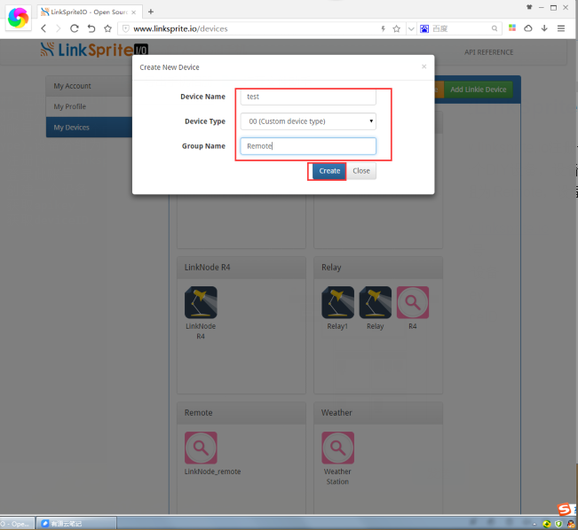
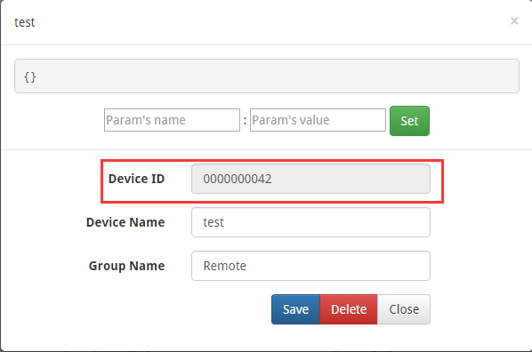
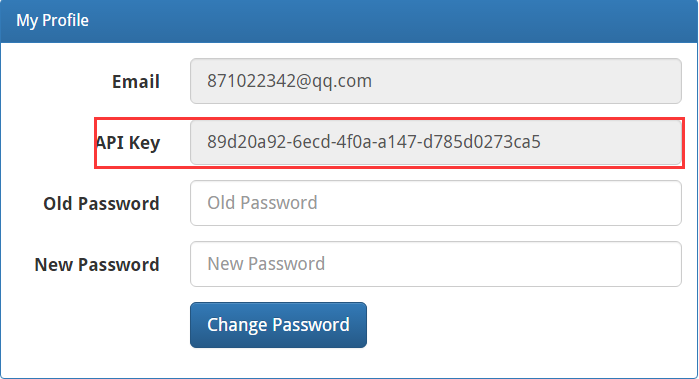

### 准备材料
* LinkNode D1 x 1   
* Infrared Shield x 1  
* 带遥控器的设备 x 1

### 注册登录[LinkSprite.io](www.linksprite.com)
网页进入www.linksprite.io注册一个账号，并登录，在自己的账号下面建一个DIY设备，设备类型为00(Custom device type),设备分组为Remote，设备名可以自己DIY。   
* 注册[www.linksprite.io](www.linksprite.com)
* 登录此账号  
* 创建一个设备
* 获取apikey
* 获取deviceID   
  
  
  
 
### github获取代码
将github上获取的到文件夹放到Arduino IDE编译工具文件夹目录下的libraries目录下。打开Aeduin IDE工具选择我们刚刚添加的库目录下的D1_remote打开，修改相应的deviceID和apikey.
* 获取代码
* 放到Arduino ID的librarys目录
* 修改deviceID和apikey
* 连接LinkNode D1与PC
* 编译上传程序至LinkNode D1

### github获取app并录入一个遥控器  
* 获取APP
* 账户登陆
* Linksprite设备管理
* 遥控器管理
* 遥控器录入、使用

1. 下载地址  
安卓app可以在github直接获取  

2. 下载安装后打开软件登陆账户，账户是前面在linksprite.io注册的账户。如图所示：  
   

3. 登陆成功后,进入Linksprite设备列表，此时便可以看到我们在前面注册的设备了。  
   

4. 点击这个设备，显示遥控器列表，可以添加遥控器设备，长按遥控器列表，可对遥控器的备注进行修改。   

5. 选择一个按钮长按，此时遥控器对这LinkNode D1，按下相应的遥控器按键，此时便会录入相应的按键，录入成功App的按钮会被高亮。 
  

6. 按照上述的方法我们可以录入一个遥控器，然后我们的遥控器就会复制到我们的手机上了，此时试试我们的新遥控器吧。
  

### 备注
遥控器的app我们还提供了可以注册官方设备，利用的是扫描二维码添加注册设备。
    
现在我们的遥控器只支持几个厂家的遥控器设备的录入，当然这也是可以自己添加的，如果没有你想要的厂商遥控器，你只需要查相应厂商遥控器的信息在IRremoteESP8266.cpp，IRremoteESP8266.h，LinkNodeRemote.ino修改相应的代码，这个部分我们暂时不容易修改，后续还会更新。尽请期待！
